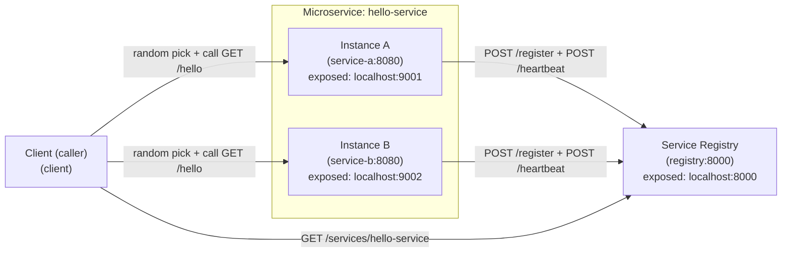

# Microservice Discovery (Registry + 2 Instances + Client)

This project implements the required flow:

- **2 service instances** (`service-a` + `service-b`) run on **different ports** and register themselves
- A **service registry** stores active instances (with TTL + heartbeats)
- A **client** discovers instances from the registry and calls a **random** instance (no hardcoded instance address)

## Architecture diagram



## Quick start (Docker Compose)

From this folder:

```bash
docker compose up --build
```

## How to test (end-to-end)

Make sure everything is running first:

```bash
docker compose up --build
```

### Step 1: Verify registry is running

```bash
curl -s http://localhost:8000/health
```

Expected (shape):

- contains `"ok": true`

### Step 2: Verify both service instances are running

```bash
curl -s http://localhost:9001/health
curl -s http://localhost:9002/health
```

Expected:

- Both return JSON with `service: "hello-service"` and different `instance_id` values (`hello-a` vs `hello-b`).

### Step 3: Verify services registered with the registry

```bash
curl -s http://localhost:8000/services/hello-service
```

Expected:

- An array of **2** instances with `instance_id` `hello-a` and `hello-b`.

This proves services successfully registered with the registry.

### Step 4: Test direct service responses

```bash
curl -s http://localhost:9001/hello
curl -s http://localhost:9002/hello
```

Expected:

- Both return valid JSON
- Each shows a different `instance_id` (`hello-a` vs `hello-b`)

### Step 5: Test client-based service discovery (IMPORTANT)

The client runs automatically in Compose and prints which instance it chose.

In a new terminal:

```bash
docker compose logs -f client
```

Expected:

- Lines like:
  - `[client] -> hello-a @ service-a:8080 => ...`
  - `[client] -> hello-b @ service-b:8080 => ...`

### Step 6: Verify random load balancing

Let the client run for ~20–30 seconds while watching logs:

```bash
docker compose logs -f client
```

Expected:

- You should see **both** `hello-a` and `hello-b` being selected over time.

This proves the client discovers the service and randomly selects an instance.

### Step 7: Failure / resilience test (very important)

Stop one service instance:

```bash
docker compose stop service-b
```

Wait ~10–15 seconds (TTL expiry; default TTL is 10 seconds).

Then check:

```bash
curl -s http://localhost:8000/services/hello-service
```

Expected:

- Only **1** instance remains (typically `hello-a`).

Now watch the client:

```bash
docker compose logs -f client
```

Expected:

- Calls continue and always pick the remaining instance.

This proves the registry removes dead instances and the system still works.

### Step 8: Bring the instance back (optional)

```bash
docker compose start service-b
```

Then:

```bash
curl -s http://localhost:8000/services/hello-service
```

Expected:

- The list returns to **2** instances after it registers again.

## Endpoints

### Registry (`localhost:8000`)

- `POST /register` – register/update an instance
- `POST /heartbeat` – refresh TTL (JSON body: `{"service": "...", "instance_id": "..."}`)
- `POST /deregister` – remove an instance (best-effort)
- `GET /services/{service_name}` – list active instances
- `GET /health` – health check

### Service instances (`localhost:9001`, `localhost:9002`)

- `GET /hello` – returns instance identity
- `GET /health` – health check

### Client

- Not an HTTP server; it runs continuously and logs:
  - discovery from the registry
  - the **randomly chosen** instance
  - the response body
