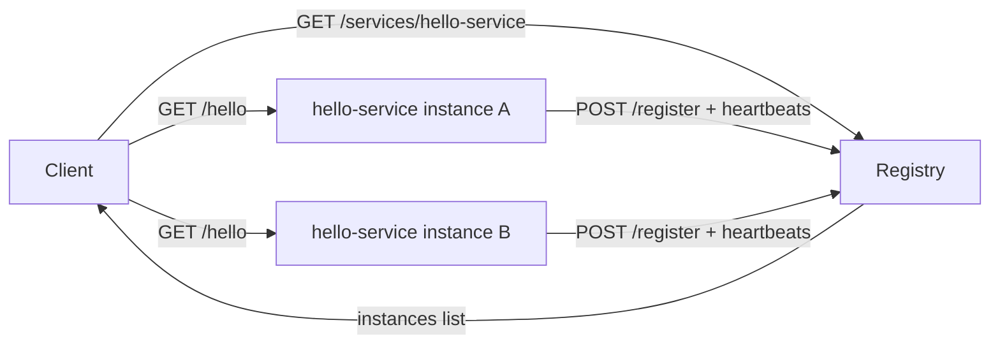

# Microservice with Discovery (Registry + 2 Instances + Client)

## What you get
- **2 service instances** running simultaneously
- **Self-registration** with a **registry**
- **Client-side discovery** (client queries registry)
- **Random instance selection** (client load-balances by choosing a random instance)

## Architecture diagram



## Quickstart (Docker Compose)
Prereqs: Docker Desktop (Compose v2).

```bash
docker compose up --build
```

You should see logs from:
- `registry` (listening on `:8000`)
- `service-a` and `service-b` (each registers + heartbeats)
- `client` (discovers instances and calls random one)

## Run without Docker (optional)
In three terminals:

```bash
cd registry && python -m venv .venv && source .venv/bin/activate && pip install -r requirements.txt
uvicorn app.main:app --host 0.0.0.0 --port 8000
```

```bash
cd service && python -m venv .venv && source .venv/bin/activate && pip install -r requirements.txt
REGISTRY_URL=http://localhost:8000 SERVICE_NAME=hello-service SERVICE_HOST=localhost SERVICE_PORT=9001 INSTANCE_ID=hello-a uvicorn app.main:app --host 0.0.0.0 --port 9001
```

```bash
cd service && source .venv/bin/activate
REGISTRY_URL=http://localhost:8000 SERVICE_NAME=hello-service SERVICE_HOST=localhost SERVICE_PORT=9002 INSTANCE_ID=hello-b uvicorn app.main:app --host 0.0.0.0 --port 9002
```

Then run the client:

```bash
cd client && python -m venv .venv && source .venv/bin/activate && pip install -r requirements.txt
REGISTRY_URL=http://localhost:8000 SERVICE_NAME=hello-service CALL_PATH=/hello INTERVAL_SECONDS=2 python app/main.py
```

### Verify manually
Registry health:

```bash
curl -s http://localhost:8000/health | jq
```

Discover instances:

```bash
curl -s http://localhost:8000/services/hello-service | jq
```

Call an instance directly (ports are mapped):

```bash
curl -s http://localhost:9001/hello | jq
curl -s http://localhost:9002/hello | jq
```

## Demo video checklist (what to record)
1. `docker compose up --build`
2. Show registry listing 2 instances:
   - `curl -s http://localhost:8000/services/hello-service | jq`
3. Show client picking different instances over time in logs (`client` output).
4. Optional: stop one instance (e.g., `service-b`) and show the registry expiring it + client continuing.

## Repo deliverable (GitHub)
If you need to publish to GitHub:

```bash
git init
git add .
git commit -m "Microservice discovery via custom registry"
# create a GitHub repo, then:
git remote add origin <your-repo-url>
git push -u origin main
```

## Notes
- Registry uses TTL: instances must heartbeat; stale instances are automatically removed.
- The client does **client-side discovery** and random selection.

## Optional: Service Mesh Discovery (Istio / Linkerd)
In a mesh, discovery and load balancing are typically handled by proxies:

```text
App → Sidecar Proxy → Service Mesh → Sidecar Proxy → App
```

Benefits:
- **Traffic routing**: retries, canary, circuit breaking, L7 policies
- **Observability**: metrics/traces/logs across services
- **Security**: mTLS, authz policies, identity-based access

